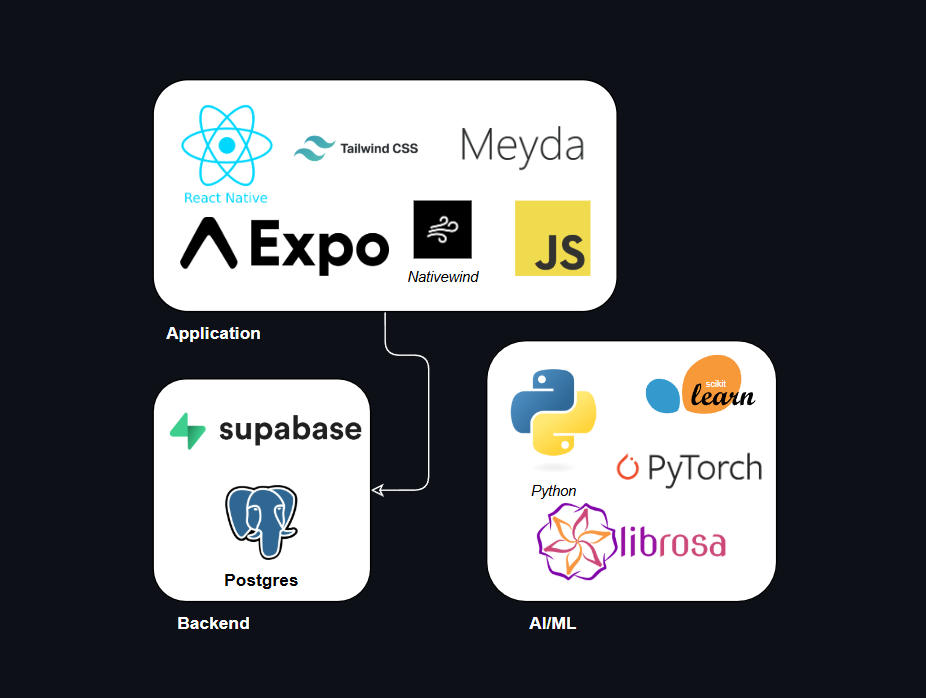
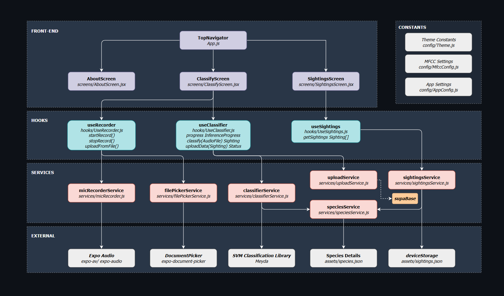

# 🐸 FrogFinder | RMIT Capstone Project

Final year capstone project for a multidisciplinary group of RMIT students.

Application for automated classification of Australian frog species from environmental audio recordings, extending previous semester's capstone project.

---

## 👥 Members

| Name | Role |
|------|------|
| Ashley McKinnon | Project Lead |
| Bridget Valder | Frontend |
| Daniel Lienert | ML/AI |
| Lenneth Rosario | Backend |
| Vinuka Goonetillake | UX/QA |

---

## 🛠️ Tech Stack

### Application & Frontend


### Backend


### AI/ML


---

## 🏛️ Architecture



**All processing runs on-device** - No external dependencies (backend/database for population tracking)

## 🏗️ Component Diagram



---

## 📁 Project Structure

```
project-pobblebonk/
├── FrogFinder/             # React Native mobile app
│   ├── screens/            # UI screens
│   ├── hooks/              # State management
│   ├── services/           # Business logic
│   ├── config/             # App configuration
│   └── assets/             # Images and data
│
├── ModelTraining/          # ML model training
│   ├── Feature Extraction/ # MFCC and spectrograms
│   ├── Trained Models/     # Model checkpoints
│   └── Training Audio/     # 50+ frog species
│
└── documentation/          # Project docs
```

---

## 📲 Build and Run

See [SETUP.MD](documentation/SETUP.md) file for detailed installation and running instructions.

**Quick start:**
```bash
cd FrogFinder
npm install
npm start
# Scan QR code with Expo Go
```

---

## 📊 Data

Large data files (raw audio, spectrograms, model checkpoints) are **not committed to this repository**.

Shared data is stored externally.

All local data directories should be added to local `.gitignore`:

---

## 🌿 Branching Convention

| Prefix | Use |
|---|---|
| `feature/` | New functionality |
| `fix/` | Bug fixes |

**Format:** `feature/<short-description>` or `fix/<short-description>`

**Examples:**
```
feature/spectrogram-preprocessing
feature/cnn-transfer-learning
fix/class-imbalance-weighting
fix/audio-normalisation-bug
```

All branches should be created from `main` and submitted via pull request. Direct pushes to `main` are disabled.

---

## 🔄 Pull Requests

Use the PR template located at `.github/pull_request_template.md`. Every PR must include a linked Trello card number.

